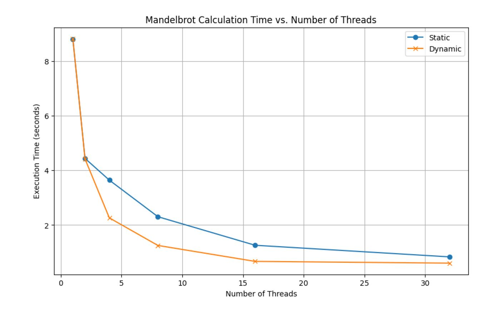
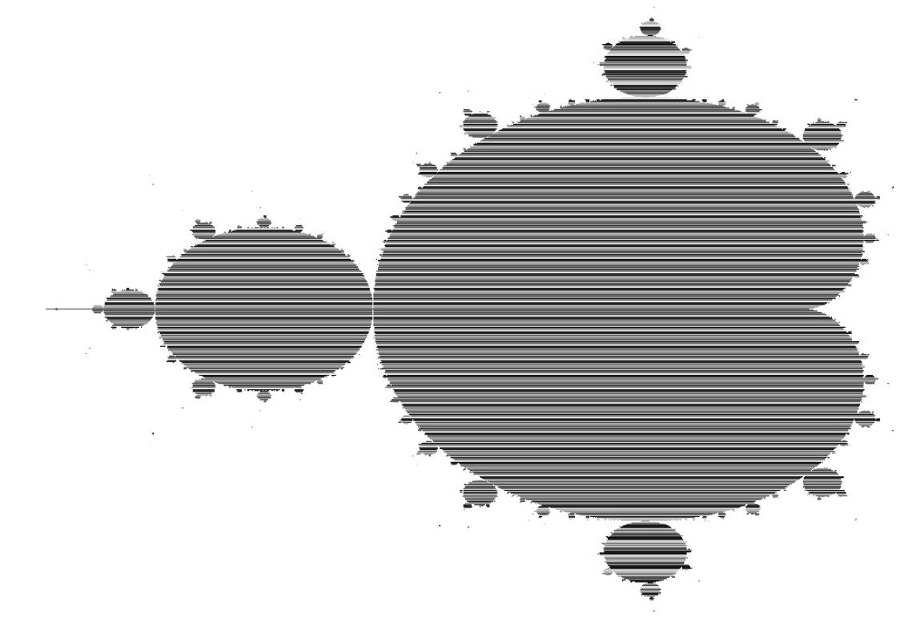

# Parallel Mandelbrot Set Generator

This repository hosts the implementation of a parallel Mandelbrot set generator. The code in `mandelbrot-parallel.cpp` leverages multi-threading to compute the Mandelbrot set using either static or dynamic work allocation strategies. This project includes detailed performance analysis, comparing the efficiency of both work allocation methods.

## Author

Saleh Elkaza

## Features

- Implementation of Mandelbrot set generation using C++ and parallel programming techniques.
- Static and dynamic work allocation for thread management.
- Performance analysis with different thread counts on ALMA node, which has 16 cores with hyperthreading enabled.
- Atomic operations to prevent race conditions when counting pixels inside the set.

## Performance Analysis

The `run-test.sh` script is included to automate the running of the program with various thread counts and work allocation strategies. Results are outputted to `performance_results.csv` for easy analysis.

### Execution Time vs. Number of Threads



### Mandelbrot Set Visualizations

#### Dynamic Worker Allocation



#### Static Worker Allocation


## Building and Running

To build the program, make sure you have a C++ compiler and support for C++20 or later. You can compile the program with a command such as:

```bash
g++-11.2.0 -std=c++20 -O2 -lpthread -o s mandelbrot-parallel.cpp
```
To run:
```bash
srun --nodes=<nodes number>
```
Please replace nodes number with any number you wish and keep in mind that your system support this number of nodes.

To run the tests and generate the performance data:

```bash
chmod +x run-test.sh
./run-test.sh
```

## Additional Information

The `mandelbrot-helpers.hpp` file provided by the parallel computing course contains utility functions and data structures used by the main program.
